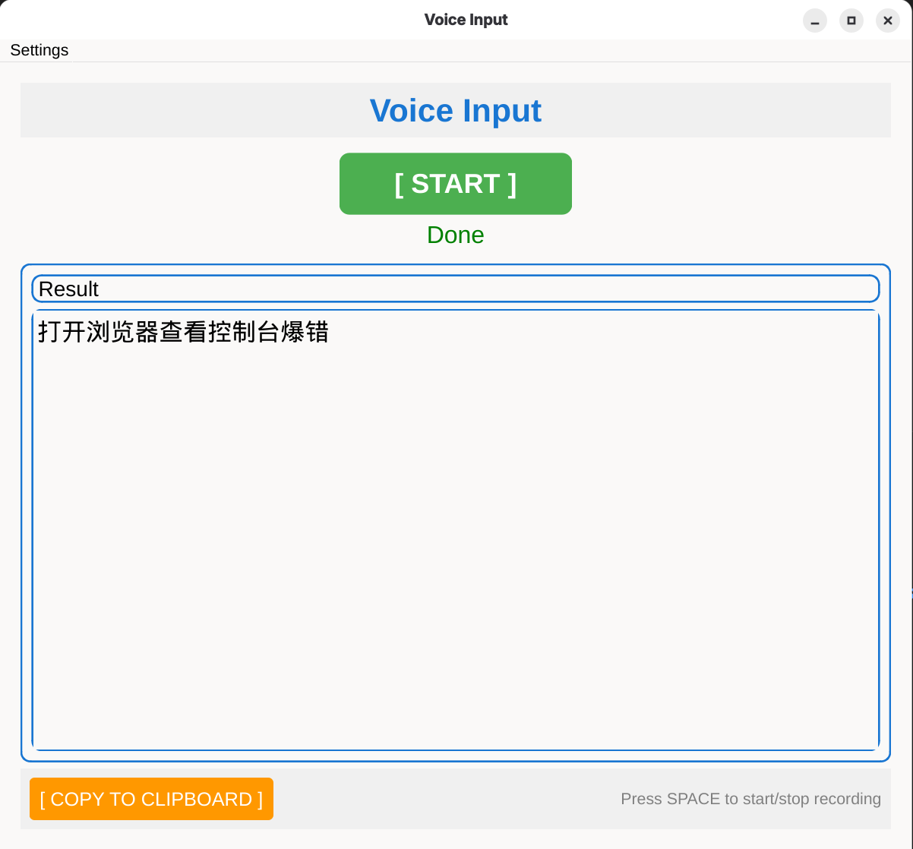

# Whisper Input Method

语音输入工具 - 录音、转写、自动复制到剪贴板。



## 功能

- 按 **空格键** 或点击按钮开始/停止录音
- 自动转写为文字（支持中文、英文、日文、韩文）
- 自动复制到剪贴板
- 繁体字自动转为简体字
- 转写完成后自动关闭程序
- 支持配置：模型选择、语言选择、线程数

## 运行

### 方式一：直接运行

```bash
uv run main.py
```

### 方式二：打包成可执行文件

```bash
# 安装 PyInstaller
uv pip install pyinstaller

# 打包（生成单个可执行文件）
uv run pyinstaller --onefile --windowed --name whisper-im main.py

# 运行打包后的程序
./dist/whisper-im
```

## 配置

点击菜单栏 **Settings** 可配置：

- **Backend**: Default (whisper.cpp) / OpenVINO
- **Models Dir**: 模型目录路径（如 `~/.cache/whisper/models`）
- **Model**: tiny / base / small / medium / large
- **Language**: auto / zh / en / ja / ko
- **Threads**: 1 / 2 / 4 / 8 / 16

OpenVINO 后端会自动加载对应的 encoder 文件（`ggml-*-encoder-openvino.xml`）。

配置保存在 `~/.config/whisper-im/config.json`

## Whisper.cpp 环境配置

### 后端模式

程序支持两种后端模式：

- **Default (默认)**: 使用 whisper.cpp 原生实现
- **OpenVINO**: 使用 Intel OpenVINO 加速 encoder 推理（需要 Intel CPU）

OpenVINO 模式在 Settings 中选择，选择后模型会自动添加 `-oved CPU` 参数。

### 1. 克隆 whisper.cpp 仓库

```bash
# 在项目根目录下克隆
git clone https://github.com/ggerganov/whisper.cpp.git
cd whisper.cpp
```

### 2. 编译 whisper-cli

**方式一：标准编译（无加速）**

```bash
cmake -B build -DCMAKE_BUILD_TYPE=Release
cmake --build build -j$(nproc) --config Release
```

**方式二：OpenVINO 加速编译（推荐，适用于 Intel CPU）**

首先安装 OpenVINO 2024.6 开发包（**必须使用 2024.6 版本**以对齐 whisper.cpp）：

- [参考官方安装指南](https://www.intel.com/content/www/us/en/developer/tools/openvino-toolkit/download.html)

```bash
# Fedora/RHEL
sudo dnf install openvino-devel-2024.6.0

# Ubuntu/Debian 或其他系统
# 按照官方指南下载并安装 OpenVINO 2024.6
```

然后编译：

```bash
cmake -B build -DWHISPER_OPENVINO=1
cmake --build build -j$(nproc) --config Release
```

编译完成后，可执行文件位于：`build/bin/whisper-cli`

### 3. 下载模型

可用模型：`tiny`, `base`, `small`, `medium`, `large`, `large-v3` 等

#### 选择 A：仅使用 Default 后端（标准模式）

如果只使用默认后端，直接下载模型即可：

```bash
cd whisper.cpp/models

# 下载模型（以 base 为例）
./download-ggml-model.sh base
```

下载完成后，会生成：

- `ggml-base.bin` - 主模型文件

#### 选择 B：使用 OpenVINO 后端（推荐，需要 Intel CPU）

如果使用 OpenVINO 后端，需要**同时下载模型和转换 encoder**：

```bash
cd whisper.cpp/models

# 1. 下载主模型
./download-ggml-model.sh base

# 2. 安装 Python 依赖并转换 encoder
python -m venv .venv
source .venv/bin/activate
pip install openvino-dev[pytorch,onnx]
pip install openai-whisper
pip install onnxscript

# 3. 转换 encoder（必须与主模型同名）
python convert-whisper-to-openvino.py --model base
```

完成后，models 目录会包含以下文件（以 base 为例）：

- `ggml-base.bin` - 主模型文件
- `ggml-base-encoder-openvino.xml` - OpenVINO encoder 配置
- `ggml-base-encoder-openvino.bin` - OpenVINO encoder 权重

**注意**：OpenVINO 模式需要同时保留主模型和 encoder 文件，程序会在 Settings 选择 OpenVINO 后端时自动使用。

### 4. 配置路径

### 程序如何查找 whisper-cli 和模型

程序按以下顺序查找 `whisper-cli`：

1. PATH 环境变量中的 `whisper-cli`
2. 默认路径 `whisper.cpp/build/bin/whisper-cli`

模型查找路径：

1. Settings 中配置的 **Models Dir**
2. 默认路径 `whisper.cpp/models`

**注意**：从 GUI 启动程序时不会读取 shell 环境变量，请使用 Settings 对话框配置模型目录。

## 系统要求

- **Linux** 系统
- **Wayland** 桌面环境
- **Python 3.11+**

### 必需的系统依赖

```bash
# Fedora/RHEL
sudo dnf install alsa-utils wl-clipboard

# Ubuntu/Debian
sudo apt install alsa-utils wl-clipboard

# Arch Linux
sudo pacman -S alsa-utils wl-clipboard
```

**依赖说明**：

- `arecord`（来自 alsa-utils）- 用于录音
- `wl-copy`（来自 wl-clipboard）- 用于在 Wayland 下复制到剪贴板
